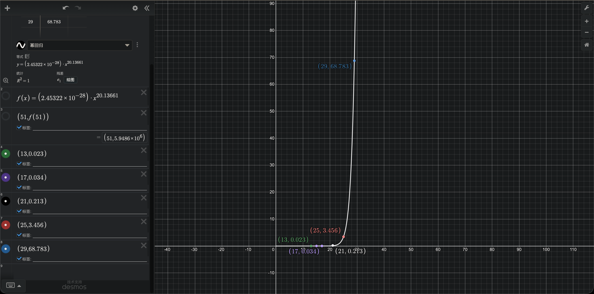
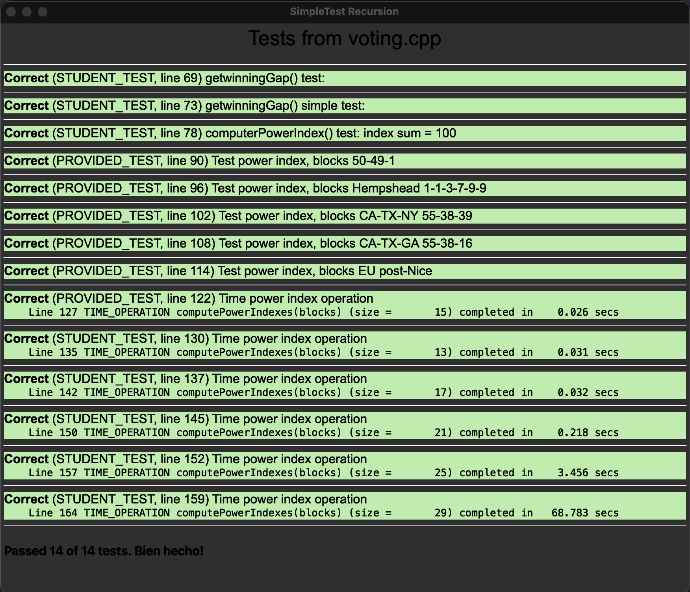
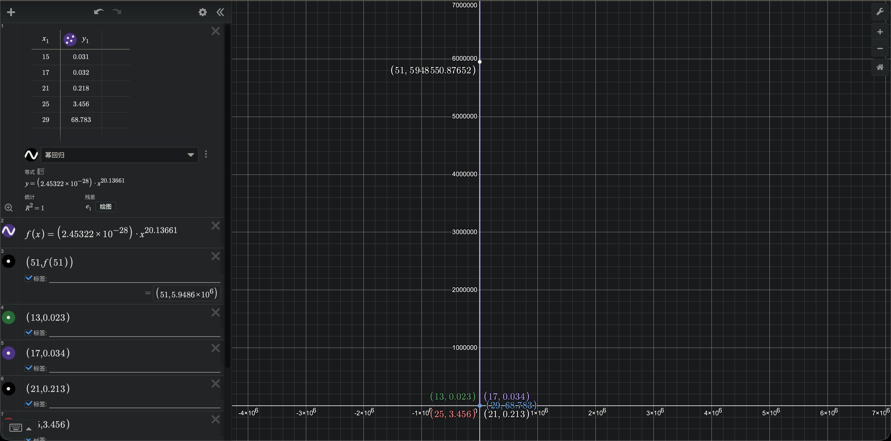

Before submitting this file, make sure that there are no more TODO
placeholders remaining in the file (and remove this comment too).

## Fundamentals Warmup

Q1. Looking at a call stack listing in a debugger, what is the indication that the program being debugged uses recursion?

```
A1. 出现了大量相同地址的函数,被连续调用多次
```

Q2. Subtract the innermost level number from the outermost to get the maximum count of stack frames that fit in the capacity of the call stack. How many stack frames fit in your system's call stack?

```
A2.
parameter n at innermost level (Level 1) in the call stack: 0
What is the highest numbered level shown in the call stack: 16628
```

Q3. Describe how the symptoms of infinite recursion differ from the symptoms of an infinite loop.

```
A3. 无限循环应该是单一栈不终止或占用巨大内存;无限递归则是尝试调用无限多栈,并最终栈溢出.
```

Q4. What is the pattern to which values of base number and exponent result in a test failure?

```
A4. base: -10 exp: 2 = -100 ( correct pow(): 100 )
```

Q5. Of the existing five cases, are there any that seem redundant and can be removed from the function? Which do you think are absolutely necessary? Are there any cases that you're unsure about?

```
A5. 对于 base case, 只有 exp == 0 的情况是必须的,其他的分类讨论都可以删除.
```

## Balanced Operators

Q6. Compare your recursive solution to the iterative approach used for the Check Balance problem in Section 1. Which version do you find easier to read and understand? In which version did you find it easier to confirm the correct behavior?

```
A6. 个人更喜欢递归版本,熟悉递归之后发现这种代码逻辑非常简单.
```

## Merge Sorted Sequences

Q7. Give a rough estimate of the maximum length sequence that could be successfully merged on your system assuming a recursive implementation of binaryMerge.

```
A7. 我的电脑大概可以容纳1600个栈,所以无论算法如何,其最大可以合并的字符串必然小于1600字符.
```

Q8. What would be the observed behavior if attempting to recursively merge a sequence larger than that maximum?

```
A8. 栈溢出,程序直接闪退.
```

Q9. Include the data from your execution timing and explain how it supports your Big O prediction for binaryMerge.

```
A9.
Correct (STUDENT_TEST, line 136) binaryMerge(), time check
    Line 144 TIME_OPERATION binaryMerge(m, n) (size =        1) completed in    0.000 secs
    Line 144 TIME_OPERATION binaryMerge(m, n) (size =        2) completed in    0.000 secs
    Line 144 TIME_OPERATION binaryMerge(m, n) (size =        4) completed in    0.000 secs
    Line 144 TIME_OPERATION binaryMerge(m, n) (size =        8) completed in    0.000 secs
    Line 144 TIME_OPERATION binaryMerge(m, n) (size =       16) completed in    0.000 secs
    Line 144 TIME_OPERATION binaryMerge(m, n) (size =       32) completed in    0.000 secs
    Line 144 TIME_OPERATION binaryMerge(m, n) (size =       64) completed in    0.000 secs
    Line 144 TIME_OPERATION binaryMerge(m, n) (size =      128) completed in    0.000 secs
    Line 144 TIME_OPERATION binaryMerge(m, n) (size =      256) completed in    0.000 secs
    Line 144 TIME_OPERATION binaryMerge(m, n) (size =      512) completed in    0.000 secs
    Line 144 TIME_OPERATION binaryMerge(m, n) (size =     1024) completed in    0.000 secs
    Line 144 TIME_OPERATION binaryMerge(m, n) (size =     2048) completed in    0.001 secs
    Line 144 TIME_OPERATION binaryMerge(m, n) (size =     4096) completed in    0.001 secs
    Line 144 TIME_OPERATION binaryMerge(m, n) (size =     8192) completed in    0.003 secs
    Line 144 TIME_OPERATION binaryMerge(m, n) (size =    16384) completed in    0.005 secs
    Line 144 TIME_OPERATION binaryMerge(m, n) (size =    32768) completed in    0.008 secs
    Line 144 TIME_OPERATION binaryMerge(m, n) (size =    65536) completed in    0.017 secs
    Line 144 TIME_OPERATION binaryMerge(m, n) (size =   131072) completed in    0.035 secs
    Line 144 TIME_OPERATION binaryMerge(m, n) (size =   262144) completed in    0.069 secs
    Line 144 TIME_OPERATION binaryMerge(m, n) (size =   524288) completed in    0.137 secs

增速为O(n).
```

Q10. Include the data from your execution timing and explain how it supports your Big O prediction for naiveMultiMerge.

```
A10.
Correct (STUDENT_TEST, line 193) naiveMultiMerge(), time check
    Line 209 TIME_OPERATION naiveMultiMerge(all) (size =       12) completed in    0.000 secs
    Line 209 TIME_OPERATION naiveMultiMerge(all) (size =       24) completed in    0.000 secs
    Line 209 TIME_OPERATION naiveMultiMerge(all) (size =       48) completed in    0.000 secs
    Line 209 TIME_OPERATION naiveMultiMerge(all) (size =       96) completed in    0.000 secs
    Line 209 TIME_OPERATION naiveMultiMerge(all) (size =      192) completed in    0.000 secs
    Line 209 TIME_OPERATION naiveMultiMerge(all) (size =      384) completed in    0.000 secs
    Line 209 TIME_OPERATION naiveMultiMerge(all) (size =      768) completed in    0.000 secs
    Line 209 TIME_OPERATION naiveMultiMerge(all) (size =     1536) completed in    0.000 secs
    Line 209 TIME_OPERATION naiveMultiMerge(all) (size =     3072) completed in    0.002 secs
    Line 209 TIME_OPERATION naiveMultiMerge(all) (size =     6144) completed in    0.003 secs
    Line 209 TIME_OPERATION naiveMultiMerge(all) (size =    12288) completed in    0.006 secs
    Line 209 TIME_OPERATION naiveMultiMerge(all) (size =    24576) completed in    0.012 secs
    Line 209 TIME_OPERATION naiveMultiMerge(all) (size =    49152) completed in    0.022 secs
    Line 209 TIME_OPERATION naiveMultiMerge(all) (size =    98304) completed in    0.044 secs
    Line 209 TIME_OPERATION naiveMultiMerge(all) (size =   196608) completed in    0.089 secs
    Line 209 TIME_OPERATION naiveMultiMerge(all) (size =   393216) completed in    0.177 secs
    Line 209 TIME_OPERATION naiveMultiMerge(all) (size =   786432) completed in    0.354 secs
    Line 209 TIME_OPERATION naiveMultiMerge(all) (size =  1572864) completed in    0.711 secs
    Line 209 TIME_OPERATION naiveMultiMerge(all) (size =  3145728) completed in    1.419 secs

增速为O(n).
```

Q11. Include the data from your execution timing and explain how it demonstrates O(n log k) runtime for recMultiMerge.

```
A11.

Correct (STUDENT_TEST, line 335) recMultiMerge(), time check, keep k(Vector's size) fixed. n[ 40 , 10485760 ], k = 20
    Line 346 TIME_OPERATION recMultiMerge(all) (size =       40) completed in    0.000 secs
    Line 346 TIME_OPERATION recMultiMerge(all) (size =       80) completed in    0.000 secs
    Line 346 TIME_OPERATION recMultiMerge(all) (size =      160) completed in    0.001 secs
    Line 346 TIME_OPERATION recMultiMerge(all) (size =      320) completed in    0.000 secs
    Line 346 TIME_OPERATION recMultiMerge(all) (size =      640) completed in    0.000 secs
    Line 346 TIME_OPERATION recMultiMerge(all) (size =     1280) completed in    0.000 secs
    Line 346 TIME_OPERATION recMultiMerge(all) (size =     2560) completed in    0.001 secs
    Line 346 TIME_OPERATION recMultiMerge(all) (size =     5120) completed in    0.004 secs
    Line 346 TIME_OPERATION recMultiMerge(all) (size =    10240) completed in    0.007 secs
    Line 346 TIME_OPERATION recMultiMerge(all) (size =    20480) completed in    0.013 secs
    Line 346 TIME_OPERATION recMultiMerge(all) (size =    40960) completed in    0.026 secs
    Line 346 TIME_OPERATION recMultiMerge(all) (size =    81920) completed in    0.050 secs
    Line 346 TIME_OPERATION recMultiMerge(all) (size =   163840) completed in    0.101 secs
    Line 346 TIME_OPERATION recMultiMerge(all) (size =   327680) completed in    0.204 secs
    Line 346 TIME_OPERATION recMultiMerge(all) (size =   655360) completed in    0.407 secs
    Line 346 TIME_OPERATION recMultiMerge(all) (size =  1310720) completed in    0.809 secs
    Line 346 TIME_OPERATION recMultiMerge(all) (size =  2621440) completed in    1.627 secs
    Line 346 TIME_OPERATION recMultiMerge(all) (size =  5242880) completed in    3.257 secs
    Line 346 TIME_OPERATION recMultiMerge(all) (size = 10485760) completed in    6.520 secs

可以看到log(n)为常数,O(n log(k))整体呈现线性增长(k=20).


Correct (STUDENT_TEST, line 350) recMultiMerge(), vary k while keeping n fixed
    Line 356 TIME_OPERATION recMultiMerge(all) (size =        4) completed in    0.267 secs
    Line 356 TIME_OPERATION recMultiMerge(all) (size =       16) completed in    0.546 secs
    Line 356 TIME_OPERATION recMultiMerge(all) (size =       64) completed in    0.828 secs
    Line 356 TIME_OPERATION recMultiMerge(all) (size =      256) completed in    1.116 secs
    Line 356 TIME_OPERATION recMultiMerge(all) (size =     1024) completed in    1.405 secs
    Line 356 TIME_OPERATION recMultiMerge(all) (size =     4096) completed in    1.741 secs

n=1000000,k为4倍增长.
可以看到O(n log(k))整体呈现 1.x 倍增长.
另外,x 会逐渐趋近于 1.
```

Q12. You run recMultiMerge on a sequence of size 1 million and see that it completes just fine. Explain why this is not running afoul of the call stack capacity limitation. Hint: How many stack frames (levels) are expected to be on the call stack at the deepest point in the recursion in recMultiMerge?

```
A12. 因为这里的 recMultiMerge() 是二分增长的,面对 1000000的输入量, 实际堆栈数是 log(1000000)base 2 ≈ 19.931568569324 ,而只前 woarmup 练习中的堆栈增长数量是 O(n), 意味着堆栈数量为 1000000.
```

Q13. A search engine can't read your mind (although some use personalization to try). If you search a term like "rice" that has many meanings, most search engines will show a few different guesses as to what you might be looking for among the top results: Rice University, what is rice, local restaurants that serve rice, how to cook rice, Rice University Athletics, nutrition of rice, and so on. Search engines often create ordered lists of the most "relevant" results for a certain query. Imagine that a search engine maintains an "ordered list of relevant results for Rice University" and an "ordered list of relevant results for how to cook rice." When the search term is ambiguous, like "rice," the engine shuffles the lists together.

- How could you use your multi-merge algorithm to achieve a result like the search results you saw? Write a couple lines of pseudocode.
- How would you decide when to shuffle together different meanings of a term and when to show only one? Please provide at least two specific scenarios as examples to explain your reasoning.

```

A13.
第一小题就是普通的合并即可,只需要保证不同的关键词组之间的打分标准一致,没有某组关键词的整体分数显著高于其他组关键词就可以.
第二小题则应关注用户输入词究竟是清晰的还是模糊的,如果偏向模糊的一段,则应该多合并列表;如果偏向清晰的一端,则应该减少合并数量,凸显前几个结果在结果中的显示比例.


```

Q14. Sometimes search engines choose not to merge results and only show only one meaning or interpretation of a searched term. This often happens within a particular country or geographical area. For example, Katherine Ye & Rodrigo Ochigame show that searching the same term in different countries can deliver entirely different results, such as this search for the word "God." For more examples, see their Search Atlas.

- What does geographical sorting of search results assume about the people who live in each country? At minimum, explain your reasoning in 2-3 sentences.

```

A14.
不同国家的人们会有不同的偏好;并且某些偏好如宗教方面的偏好,非常重要,必须在搜索结果中体现出来,否则会产生冒犯.
当然,有一些更加普世和相同的概念,比如一些科学术语,可能这方面的偏好就更弱.

```

Q15. One concern raised with search engines is that they might show different results to different people based on location, language, and especially search history, isolating them from information that might help them understand more about the diverse world in which they live. You may have heard this phenomenon referred to as the creation of “filter bubbles” when the effects of this personalization are negative.

- When would it be beneficial to show personalized search results? Provide a specific example of when you think it would be beneficial, and explain your reasoning.
- Why might showing personalized results to only particular groups of people be an issue? Provide a specific example of when you think it would be harmful, and explain your reasoning.

```

A15.
语言方面是显然的,对于小语种国家输出大量英语回答,用户可能完全看不懂.
另外,许多时候用户就是想要屏蔽某一些回答比如色情相关,或者习惯特定网站的回答比如维基百科等,这样的情况营造信息茧房可能视为正面功能.

比如对于儿童如果过分限制了他们的浏览空间,反而在保护解除的时候会造成过分的冲击.
对于成年人来时,世界就是现实的世界,人们早晚都要面对现实的世界,互联网上的内容就是现实世界理想的反映,让所有人充分接触到现实的世界,有利于生活中决策的更合理性乃至经济的增长.

```

## Backtracking Warmup

Q16. What is the value of totalMoves after stepping over the call to moveTower in hanoiAnimation?

```
A16. 15
```

Q17. What is the value of the totalMoves variable after stepping over the first recursive sub-call? (In other words, within moveTower just after stepping over the first recursive sub-call to moveTower inside the else statement.)

```
A17. 7
```

Q18. After breaking at the base case of moveTower and then choosing Step Out, where do you end up? (What function are you in, and at what line number?) What is the value of the totalMoves variable at this point?

```
A18.
moveTower()函数.
第67行: moveTower(numDiscs - 1, startPeg, tempPeg, endPeg, totalMoves);
totalMoves variable: 1
```

Q19. What is the smallest possible input that you used to trigger the bug in the program?

```
A19. nums = { 3, 1, -3 };
```

Q20. Identify the one-character error in the code and explain why that one-character bug causes the function to return the output you see when running on the minimal input you listed above. You should be able to specifically account for how the error causes the result to change from “completely correct” to “terribly wrong.”

```
A20.
return 语句中的 += 导致的,使用了 += 之后,最后的 sumSoFar 结果永远是三个变量全部选取,也就是集合内所有数字的求和,如果这个求和不等于 0 的话,就会报所有子集都不等于 0,如果等于 0 的话反之,报所有子集都对于零.
在我的测试结果中,集合内元素求和等于 1,所以函数最终永远是 0.
```

## Voting (Please note that this part of A3 is completely optional and will only be considered for extra credit. If you did not submit code for this part of the assignment, Q19 and Q20 will not be considered.)

Q21. What is the Big O of computePowerIndex? Include your timing data and explain how it supports your reasoning.

```
Q21: O(n 2^n)
for 循环带来第一个 O(n),之后是二叉树的递归,带来 O(2^n),结合起来就是 O(n 2^n).
```




Q22. Use the Big O and timing data to estimate how long it would take to compute the power index for the 51 voting blocks in the U.S. Electoral College.

```
A22. 5948550s
```


