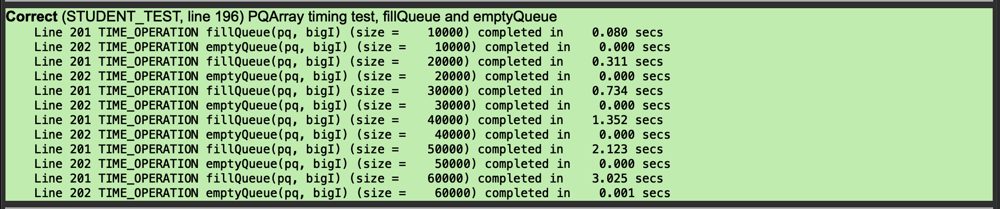
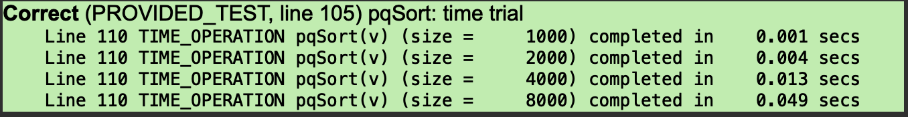
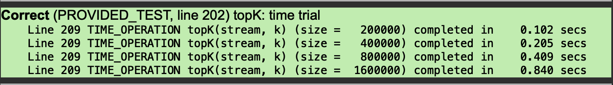
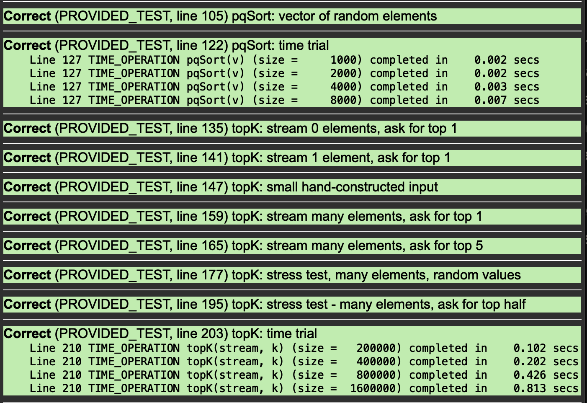

Before submitting this file, make sure that there are no more TODO
placeholders remaining in the file (and remove this comment too).

## Warmup

Q1. How do the values of the member variables of `allBalls[0]` change from iteration to iteration? Specifically, what happens to the values of `_id`, `_x`, and `_y`?

```
A1. _id 不变, _x 和 _y 会在小球碰撞到墙面的时候,取相反数翻转
```

Q2. How do the values of the member variables of the stuck ball change from iteration to iteration? Contrast this to your answer to the previous question.

```
A2. 有一个速度值会在每次迭代时自动翻转
```

Q3. After forcing the stuck ball to position (0, 0), does the ball move normally from there or does it stay stuck?

```
A3. Yes
```

<!-- _y 或 _x 生成的时候,已经和边界足够近了(<50),小球已经超出了碰撞检测,意味着每次迭代时,都会发生速度翻转.
修改方法时确保小球生成的时候,不要和边界线重合. -->

Q4. On your system, what is the observed consequence of these memory errors:

- access an index outside the allocated array bounds?
- delete same memory twice?
- access memory after it has been deleted?

```
  A4.
    - access an index outside the allocated array bounds?
        qt 编辑器会提示错误,但不会组织编译;最终在本次尝试时,程序正常执行(但下次尝试可能会失败)

    - delete same memory twice?
         通过编译,执行时报经典"段错误"

    - access memory after it has been deleted?
        qt 编辑器会提示粗我,但可以通过通过编译并运行.
        运行时,程序成功取值了该内存,但内存值已经发生了变化.
```

## PQArray

Q5. There are extensive comments in both the interface (`pqarray.h`) and implementation (`pqarray.cpp`). Explain how and why the comments in the interface differ from those in the implementation. Consider both the content and audience for the documentation.

```
A5.
.h 文件的注释,更加面向客户,高度抽象
.cpp 实现中的注释,更加具象,更专注细节,面向内部开发人员
```

Q6. The class declares member variables `_numAllocated` and `_numFilled`. What is the difference between these two counts and why are both needed?

```
A6.
_numAllocated 记录了在堆中请求的节点数量
_numFilled 记录了实际有几个节点储存了有意义的值
```

Q7. Although code within the body of a member function can directly access the object's member variables, the implementer may instead choose to call public member functions to get information about the object. For example, note how the operations `isEmpty()` and `peek()` intentionally call `size()` instead of using `_numFilled` or how `dequeue()` calls `peek()` to retrieve the frontmost element. Why might be this be considered a better design?

```
A7.
相同的逻辑尽可能只在程序中实现一次.
首先,这样写更加抽象和便于理解;其次,这样可以确保需要修改的时候,只需要改一处位置.
```

Q8. Give the results from your time trials and explain how they support your prediction for the Big-O runtimes of `enqueue` and `dequeue`.



```
A8.
对于enqueue(),单词操作时间为n,调用n次的时间复杂度为n^2,符合图中时间增长速度
dequeue()时间几乎永远为0,显然支持
```

## PQ Client

Q9. Based on the Big O of `enqueue`/`dequeue`, what do you expect for the Big O of `pqSort` if using a `PQArray`? Run some timing trials to confirm your prediction, and include that data in your answer.



```
A9.
应该是O(n^2),enqueue()是O(n),dequeue()是O(1),然后在pqSort()中,两个函数重复n次,意味着复杂度为n(n+1),化简后得O(n^2)

测试结果符合预期
```

Q10. Based on the Big O of `enqueue`/`dequeue`, what do you expect for the Big O of `topK` in terms of `k` and `n` if using a `PQArray`? Run some timing trials to confirm your prediction, and include that data in your answer.



```
A10.
时间复杂度应该是O(n),因为while()n次,每次都会调用速度为O(k)的enqueue(),所以总时间为O(nk),k省略,时间为O(n)

测试结果符合预期
```

## PQHeap

Q11. Start with an empty binary heap and enqueue the nine `DataPoint`s in the order shown below and show the result. You only need to show the final heap, not intermediate steps. Draw the heap as tree-like diagram with root element on top, its two children below, and so on. Yes, we know that we're asking you to draw pictures in a text file (we love the [AsciiFlow](http://asciiflow.com/) tool for "drawing" in text).

```
A11.
{
    { "T", 1 },
    { "B", 3 },
    { "G", 2 },
    { "S", 6 },
    { "R", 4 },
    { "V", 9 },
    { "A", 5 },
    { "O", 8 },
    { "K", 7 },
}
```

```
                      T1
                      │
                      │
                      │
             B3◄──────┴─────► G2
             │                 │
             │                 │
             │                 │
      S6 ◄───┴─► R4     V9 ◄───┴─► A5
      │
      │
      │
O8 ◄──┴──► K7
```

Q12. Make two calls to `dequeue` on the above binary heap and draw the updated result.

```
A12.
{
    { "B", 3 },
    { "R", 4 },
    { "A", 5 },
    { "S", 6 },
    { "K", 7 },
    { "V", 9 },
    { "O", 8 },
}

```

```
                      B3
                      │
                      │
                      │
             R4◄──────┴─────► A5
             │                 │
             │                 │
             │                 │
      S6 ◄───┴─► K7     V9 ◄───┴
      │
      │
      │
O8 ◄──┴
```

Q13. Draw the array representation of the binary heap above. Label each element with its array index.

```
A13.
{
    { "B", 3 }, ─────► 0
    { "R", 4 }, ─────► 1
    { "A", 5 }, ─────► 2
    { "S", 6 }, ─────► 3
    { "K", 7 }, ─────► 4
    { "V", 9 }, ─────► 5
    { "O", 8 }, ─────► 6
}
```

Q14. Re-run the timing trials on `pqclient.cpp` and provide your results that confirm that `pqSort` runs in time O(NlogN) and `topK` in O(NlogK).



```
A14.
可以看到,排序算法(pqSort)比之前有很大的加速;
对于topK(),由于logN非常小,几乎可以忽略不记,所有结果只有轻微加速.

```

## Embedded Ethics

Q15. Consider the differences between this three-bin priority queue and the priority queue you implemented on your assignment. Which would be more efficient to insert elements into and why? More generally, what are the benefits and disadvantages of using the three-bin priority queue vs. a regular priority queue?

```
A15.
three-bin priority queue 更快；因为其只需要一次判断在哪个队列之中即可插入，不需要逐个比较队列中的元素，因此其时间复杂度为 O(1)。
精度过差，只可以保存一个基本的三个层级；无法做到详细的比较。
```

Q16. Describe a real-world system where a three-bin priority queue could be used. What factors would you use to distinguish between a low vs. medium vs. high priority element? What limitations might you need to consider when using a three-bin priority queue to represent this system?

```
A16.
一个需要人主观判断高、中、低优先级的项目，同时该项目对精度的要求不是很高空，例如每日计划等，这类项目也没有办法打出确定的优先级。
```

Q17. Different admissions departments consider different factors and convert admissions criteria to numbers in different ways. Regardless of what specific factors are considered, should an admissions department use a purely numerical ranking system for applicants? Why or why not?

If yes, discuss what factors you think would be best to include when calculating numerical rankings and why those factors are well-represented as numbers. If not, discuss what factors you think should be considered in college admissions that would be difficult to represent as a numerical score. There are no right or wrong answers here – we're genuinely interested in your thoughts!

```
A17.
我认为分数是正确的，并且应该将算法公开，以实现最大效率的公平。如果算法不公开，只会增加招生的随机性。
至于纳入的东西，应该尽可能多一些，并且有精湛的算法可以放大学生的特点和体现区分度，同时也应该增加备注。
这个问题的根本不在于选拔学生，而在于必须得实现公平，公平是最重要的。
使用算法并将算法公开可以保证公平，其他的办法都是主观选择，很难保证公平。
```

Q18. Describe a real-world system that requires ranking but in which classification with a single number misses important context (i.e. a priority queue might not be the best way to store the objects being ranked). Make sure to use an example that hasn't already been discussed in lecture or in this assignment.

```
A18.
数据结构应该包含综合分数以及各个小分，以实现排序的同时提供所有信息。
很多无法被直接量化的因素，都很难使用优先级进行排序，比如影响力、重要程度、心理问题等。
```

Q19. Consider the PQueue class you just implemented. What would you change about the public interface to allow the hospital to dynamically update priorities in order to determine which patient is the best match for an organ? For any methods that you add, briefly describe when they would be used by the client and how they might be implemented privately. Note: Your design does not have to be the fastest or most efficient.

```
A19.
可以在每次获得新的器官状况后，重新评估可以改变哪些元素的优先级，之后保留一个对某一些元素优先级进行调整的接口。通过这个接口调整优先级之后，进行统一重排。
```
