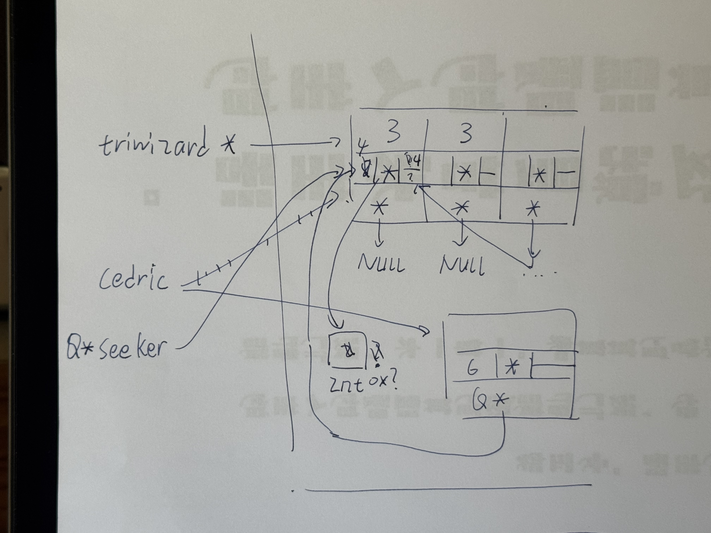
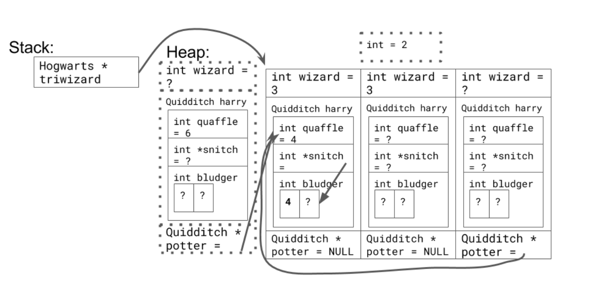
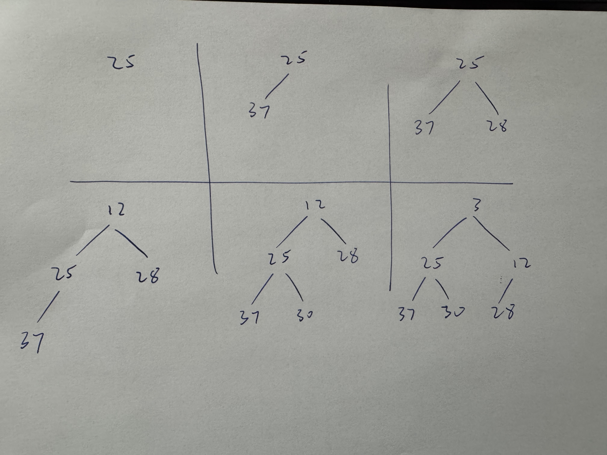
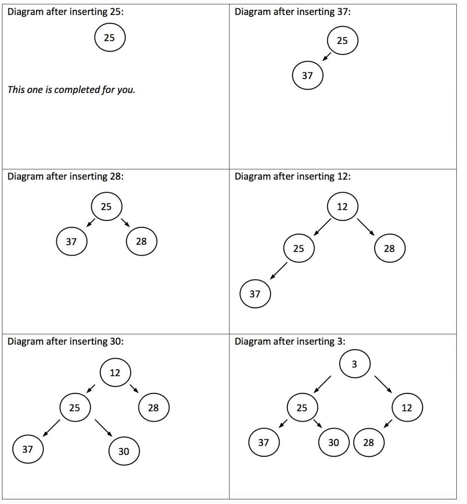
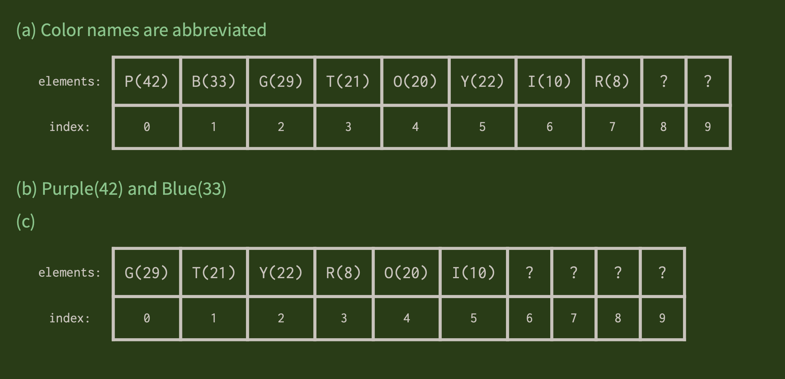

**2) A Series of Unfortunate References**

我的答案：

```txt
1 21 2
```

正确答案：

```txt
1 -84 2
```

---

**3) Pointed Points about Pointers**

我的答案：

```txt
0: 137, 0
1: 137, 10
2: 137, 20
3: 137, 30
4: 137, 40
0: 137, 137
1: 10, 10
2: 20, 20
3: 30, 30
4: 40, 40
0: 271, 271
1: 271, 271
2: 271, 271
3: 271, 271
4: 271, 271
```

正确答案：

```txt
The output of the program is shown here:
0: 137, 0
1: 137, 10
2: 137, 20
3: 137, 30
4: 137, 40
0: 137, 0
1: 137, 10
2: 137, 20
3: 137, 30
4: 137, 40
0: 137, 0
1: 137, 10
2: 137, 20
3: 137, 30
4: 137, 40
Remember that when passing a pointer to a function, the pointer is passed by value! This means that you can change the contents of the array being pointed at, because those elements aren't copied when the function is called. On the other hand, if you change which array is pointed at, the change does not persist outside the function because you have only changed the copy of the pointer, not the original pointer itself.
```

---

**4) The Hogwarts School of Pointers and Memory**

我的答案：



正确答案：



<!-- [Process PDF](./CS106BHogwartsPointerTrace.pdf) -->
<p align="center">
  <a href="./CS106BHogwartsPointerTrace.pdf">Process PDF</a>
</p>

```txt
Orphaned memory is represented with dotted lines.
For a full walkthrough of the solution,
check out: http://tinyurl.com/HogwartsPointers.
```

---

**6) Cleaning Up Your Messes**

我的答案：

```txt
Snippet 1: 双重释放了
Snippet 2: 正常
Snippet 3: 双重释放了
```

正确答案：

```txt
The first piece of code has two errors in it. First, the line
arya = jon;

causes a memory leak, because there is no longer a way to deallocate the array of three elements allocated in the first line. Second, since both arya and jon point to the same array, the last two lines will cause an error.
The second piece of code is perfectly fine. Even though we execute
delete[] stark;

twice, the array referred to each time is different. Remember that you delete arrays, not pointers.
Finally, the last piece of code has a double-delete in it, because the pointers referred to in the last two lines point to the same array.
```

---

**7) Min Heap**

我的答案：



正确答案：



---

**8) Max Heap**

我的答案：

```txt
(a):
Purple(42), Blue(33), Green(29), Teal(21), Orange(20), Yellow(22), Indigo(10), Red(8), null, null,

(b):
Purple(42), Blue(33)

(c):
Green(29), Teal(21), Yellow(22), Red(8), Orange(20), Indigo(10), null, null, null, null,
```

正确答案：


