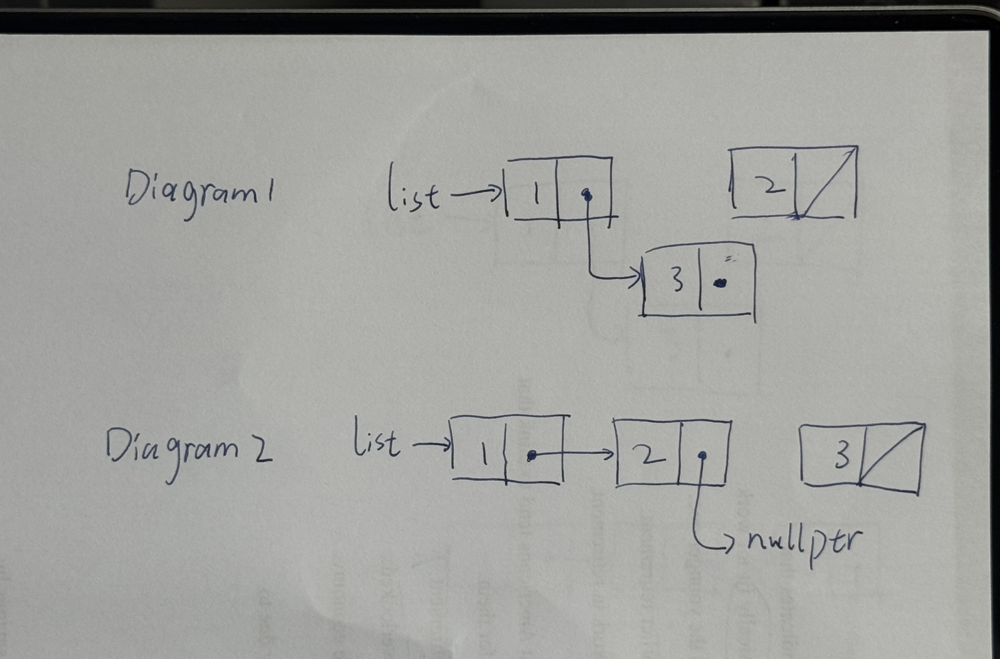
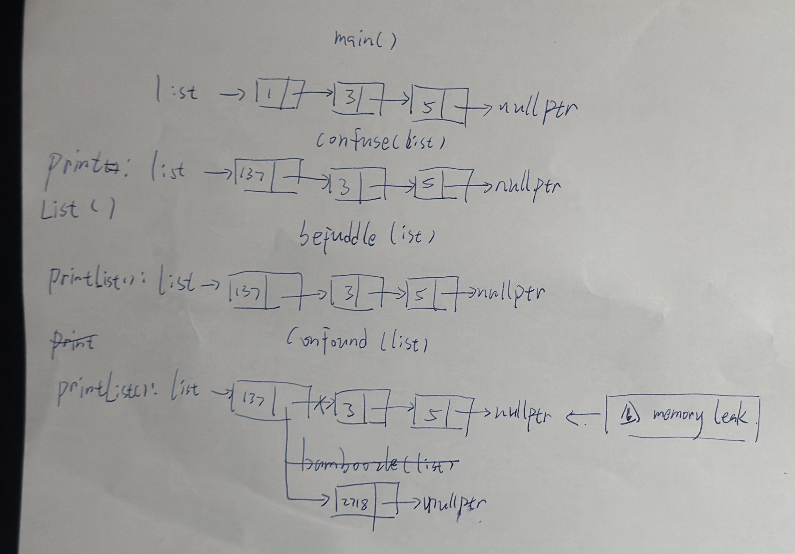
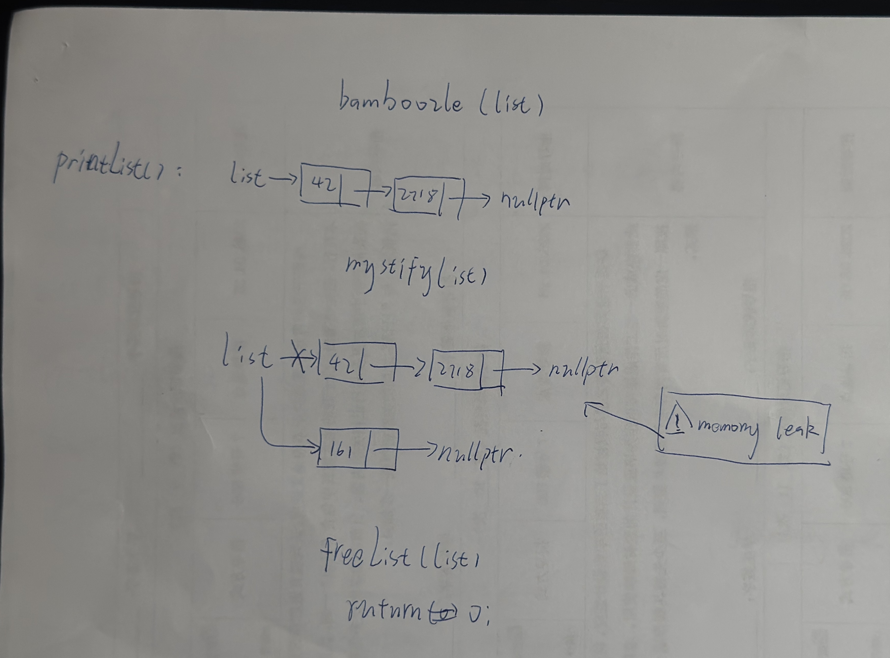
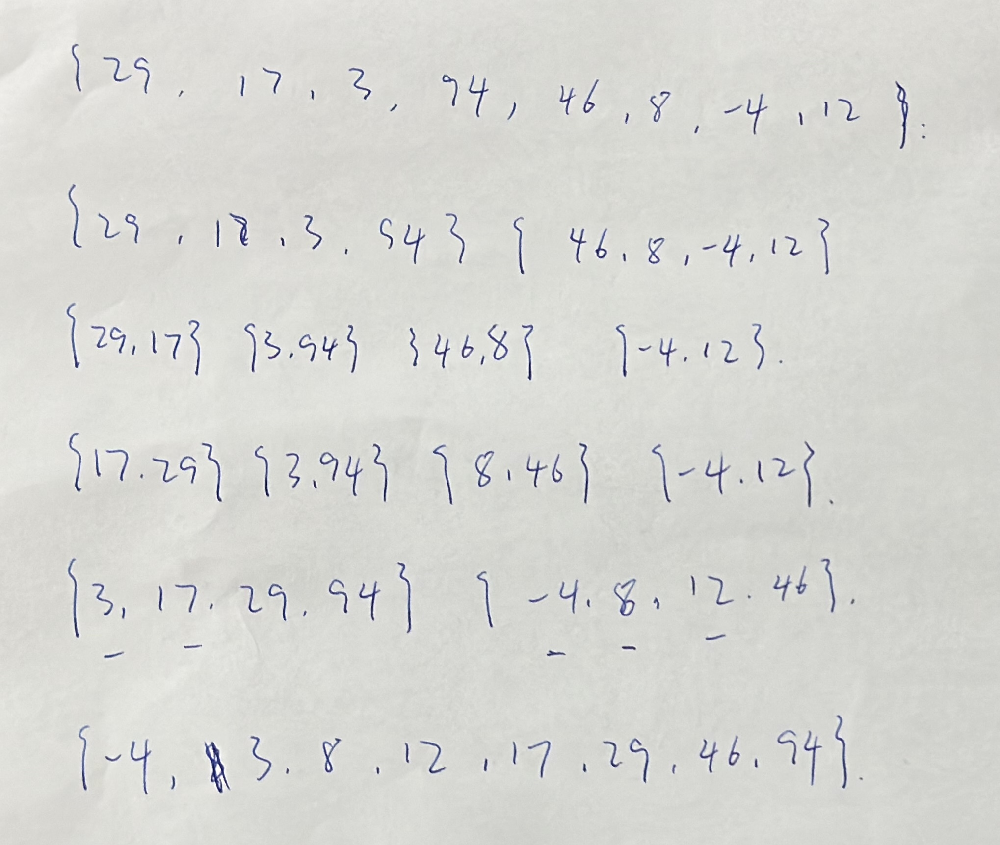

**1. What's the Code Do?**



**2) Rewiring Linked Lists**

a)

```cpp
Node* temp=list->next->next;
temp->next=list->next;
temp->next->next=list;
temp->next->next->next=nullptr;
list=temp;
```

b)

```cpp
Node* list2=list->next;
list2->next->next=list;
list2->next->next->next=nullptr;
list=list2->next;
```

**5) Tracing Pointers by Reference**



**10) Merge Sort**


**11) It Was The Best of Cases, It Was The Worst of Cases**

```txt
就是每次头部的 pivot 元素是否可以取到中间的位置,越靠近中间效率越高，越靠近两端效率越低.
高效率数组:{25,13,3,7,70,99,26}
低效率数组:{25,1,23,22,3,19,5}
```

```txt

```
